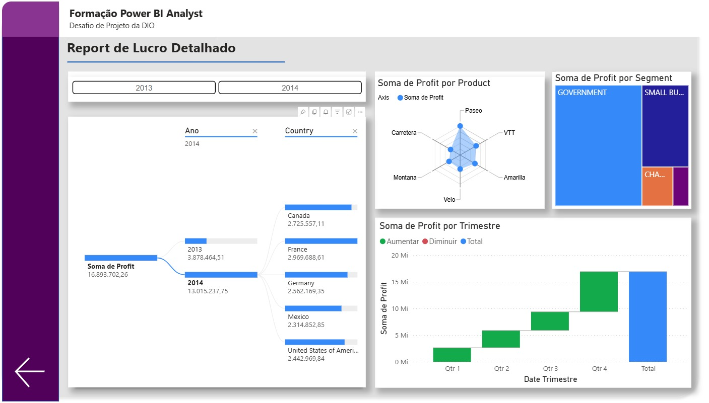

# 📊 Power BI Dashboards – Financials Sample (DIO)

Este repositório reúne todos os desafios desenvolvidos no Bootcamp **Power BI Analyst (DIO)** relacionados ao relatório **Financials Sample**.  
Cada pasta contém uma evolução diferente do mesmo relatório, aplicando melhorias de visual, experiência do usuário, análise de dados e interatividade.

---

## 📁 Estrutura do Repositório

O repositório está dividido em quatro pastas, cada uma contendo um desafio referente ao mesmo dataset:

---

## 📄 1. Desafio – Relatório Financials

**Objetivo:** Criar uma segunda página para complementar o relatório original, trazendo o lucro de forma detalhada.

**Principais itens desenvolvidos:**
- Gráficos com **Profit por País**, **Trimestre**, **Segmento** e **Produto**
- Botão de navegação para retornar à primeira página
- Layout estruturado para análise clara

**Visual do relatório:**  

---

## 🎨 2. Desafio – Experiência do Usuário (UX)

**Objetivo:** Melhorar a experiência e navegação do relatório original.

**Melhorias aplicadas:**
- Redução de elementos desnecessários
- Inclusão de novos **botões de navegação**
- Adição de **ícone de Home** para retornar à página inicial
- Relatório mais limpo e intuitivo

**Visual do relatório:**  

---

## 📊 3. Desafio – Data Analytics

**Objetivo:** Aperfeiçoar ainda mais a análise e estética do relatório.

**Implementações realizadas:**
- Nova paleta de cores combinando entre si
- Criação das páginas:
  - **Detalhes de Produtos**
  - **Detalhes de Sales**
- Botões de navegação entre páginas
- Gráficos sobrepostos com **indicadores**
   - **Semestre**
   - **Mês**
- Medidas criadas em DAX
 
**Visuais do relatório:**  
  

---

## ⚙️ 4. Desafio – Relatório Dinâmico com Parâmetros

**Objetivo:** Criar uma página dinâmica, utilizando parâmetros para alternar análises sem necessidade de múltiplos gráficos fixos.

**Implementações:**
- Parâmetros para analisar:
  - **Lucro**
  - **Vendas**
- Gráficos dinâmicos alterados conforme a seleção
- Página organizada, limpa e interativa

**Visual do relatório:**  

---

## 🚀 Tecnologias Utilizadas
- Power BI Desktop  
- DAX (Data Analysis Expressions)  
- Parâmetros  
- Botões de navegação  
- UX aplicada  
- Gráficos sobrepostos  
- Visualizações personalizadas  

---

## 🎯 Objetivo Geral
Demonstrar minha evolução no desenvolvimento de dashboards Power BI, aplicando boas práticas de visual, análise, interatividade e usabilidade utilizando o dataset **Financials Sample**.

---

